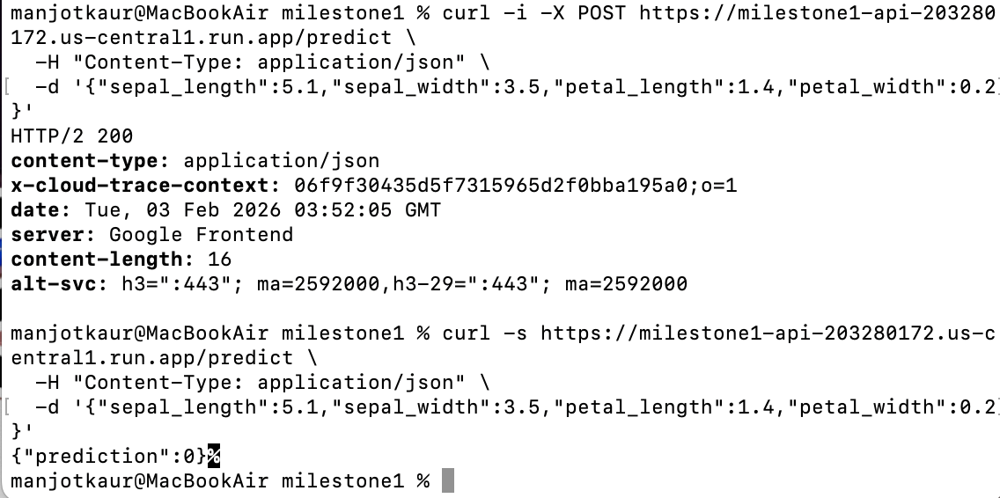
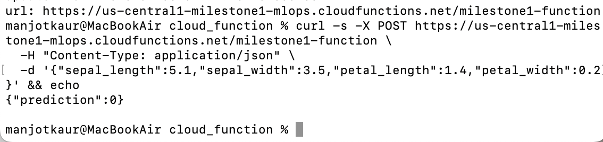

# Milestone 1 — Web & Serverless Model Serving 

## Overview
This project serves a trained scikit-learn model through:
1) A local FastAPI service  
2) A Google Cloud Run deployment  
3) A serverless Google Cloud Function   

---

## Model Lifecycle Position

This project represents the **Model Serving** stage of the machine learning lifecycle.

**Flow of data:**  
**Client Input → API Layer → Model Artifact → Prediction → Consumer**

1. A client sends JSON input to the API  
2. The API validates and parses the request using Pydantic schemas  
3. The trained model artifact (`model.pkl`) is loaded into memory  
4. The model performs inference  
5. A prediction is returned as a JSON response to the client  

---

## Model
- **Model:** scikit-learn classification model trained on Iris dataset features  
- **Artifact:** `model.pkl`  
- **Input features (4):**
  - `sepal_length`
  - `sepal_width`
  - `petal_length`
  - `petal_width`
- **Output:**
  - `prediction` (integer class)

## Project Structure
```
milestone1/
│── main.py
│── train_model.py
│── model.pkl
│── requirements.txt
│── Dockerfile
│── README.md
│
└── cloud_function/
    │── main.py
    │── model.pkl
    │── requirements.txt
```
This structure separates the API service from the serverless function.

## Part 1 — FastAPI Service (Local)

### Create and activate virtual environment
```bash
python3 -m venv venv
source venv/bin/activate
pip install -r requirements.txt
python train_model.py
uvicorn main:app --reload
curl http://127.0.0.1:8000/health
curl -X POST http://127.0.0.1:8000/predict \
  -H "Content-Type: application/json" \
  -d '{"sepal_length":5.1,"sepal_width":3.5,"petal_length":1.4,"petal_width":0.2}'
```

## Part 2 - Google Cloud Run Deployment (Docker)

**Cloud Run Service URL:**  
https://milestone1-api-203280172.us-central1.run.app

### Build and run Docker locally
```bash
docker build -t milestone1-api .
docker run --rm -p 8080:8080 -e PORT=8080 milestone1-api
docker tag milestone1-api:v3 us-central1-docker.pkg.dev/milestone1-mlops/milestone1-repo/milestone1-api:v3
docker push us-central1-docker.pkg.dev/milestone1-mlops/milestone1-repo/milestone1-api:v3
gcloud run deploy milestone1-api \
  --image us-central1-docker.pkg.dev/milestone1-mlops/milestone1-repo/milestone1-api:v3 \
  --region us-central1 \
  --allow-unauthenticated \
  --port 8080 \
  --timeout 300
curl https://milestone1-api-203280172.us-central1.run.app/health
curl -X POST https://milestone1-api-203280172.us-central1.run.app/predict \
  -H "Content-Type: application/json" \
  -d '{"sepal_length":5.1,"sepal_width":3.5,"petal_length":1.4,"petal_width":0.2}'
```

## Part 3 - Serverless Cloud Function
**Cloud Function URL:** https://us-central1-milestone1-mlops.cloudfunctions.net/milestone1-function

### Deploy and test Cloud Function
```bash
cd cloud_function
gcloud functions deploy milestone1-function \
  --gen2 \
  --runtime python311 \
  --region us-central1 \
  --source . \
  --entry-point predict \
  --trigger-http \
  --allow-unauthenticated

curl -X POST https://us-central1-milestone1-mlops.cloudfunctions.net/milestone1-function \
  -H "Content-Type: application/json" \
  -d '{"sepal_length":5.1,"sepal_width":3.5,"petal_length":1.4,"petal_width":0.2}'
```

---

## Lifecycle & Deployment Understanding

**FastAPI:**
A web service that stays running, loads the model once at startup, and handles many requests.

**Cloud Run:**
Runs the same container, automatically scales, and provides an HTTPS endpoint. Cold starts may happen when scaling from zero.

**Cloud Function:**
Runs a single function handler. It is more stateless and can cold start more often depending on traffic.

**Model–API interaction:**
Client sends JSON → server validates/parses → model artifact loaded from file → model predicts → JSON response returned.

---

## Comparison: Cloud Run vs Cloud Function

**Statefulness**
Cloud Run container: more control over app lifecycle
Cloud Function: event-driven handler, runtime may start/stop more frequently

**Artifact Loading**
Cloud Run: model loaded at container startup
Cloud Function: model may reload on cold start

**Latency**
Both can cold start, but Cloud Functions can feel more “spiky” for infrequent traffic.

**Reproducibility**
Cloud Run: dependencies fixed in Docker image
Cloud Function: reproducible via requirements.txt + runtime version

---

## Cold Start Behavior Analysis

### Cloud Run
Cloud Run may experience a cold start when scaling from zero instances. During a cold start:
- Container starts  
- Dependencies load  
- `model.pkl` loads into memory  


### Cloud Functions
Cloud Functions are more stateless and can cold start more often. During a cold start:
- Function environment initializes
- Dependencies load
- Model file loads


### Impact on Model Serving
Cold starts affect latency, not correctness. Both deployments return accurate predictions, but Cloud Run generally has more stable response times under consistent traffic.

---

## Results

### Health Check — Cloud Run
```bash
curl https://milestone1-api-203280172.us-central1.run.app/health
```

**Response**
```json
{"status":"ok"}
```

---

## Prediction — Cloud Run
```bash
curl -X POST https://milestone1-api-203280172.us-central1.run.app/predict \
  -H "Content-Type: application/json" \
  -d '{"sepal_length":5.1,"sepal_width":3.5,"petal_length":1.4,"petal_width":0.2}'
```
**Response**
```json
{"prediction":0}
```



---

## Prediction — Google Cloud Function
```bash
curl -X POST https://us-central1-milestone1-mlops.cloudfunctions.net/milestone1-function \
  -H "Content-Type: application/json" \
  -d '{"sepal_length":5.1,"sepal_width":3.5,"petal_length":1.4,"petal_width":0.2}'
```
**Response**
```json
{"prediction":0}
```




 


